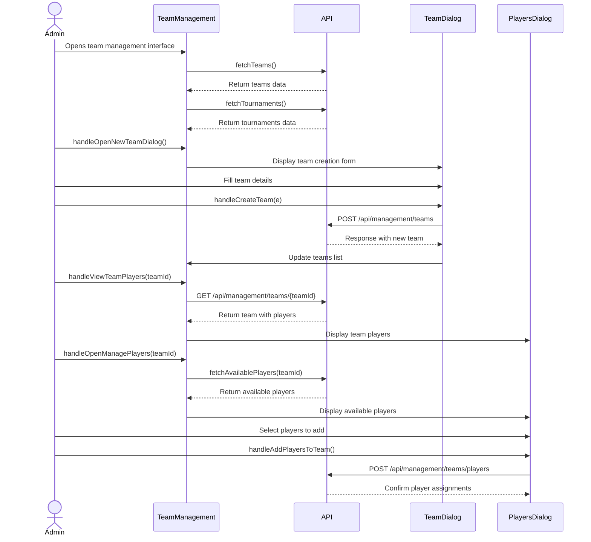
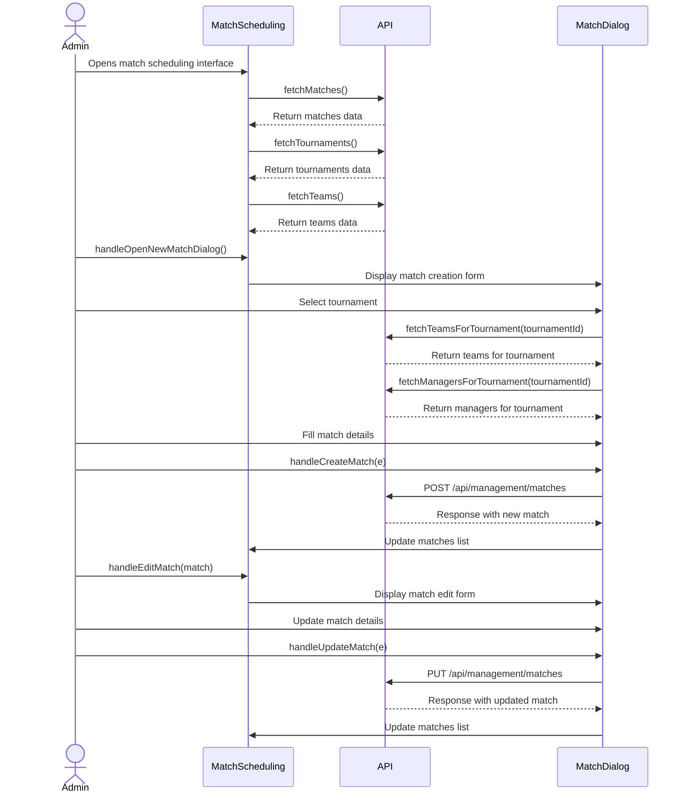
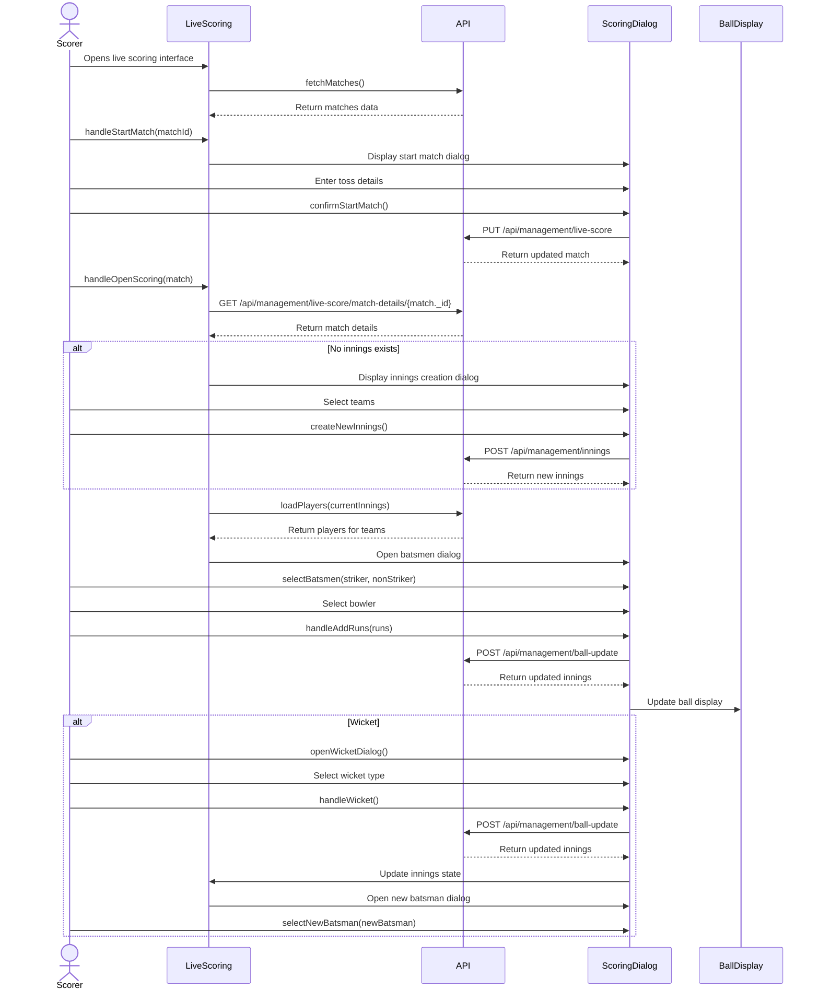
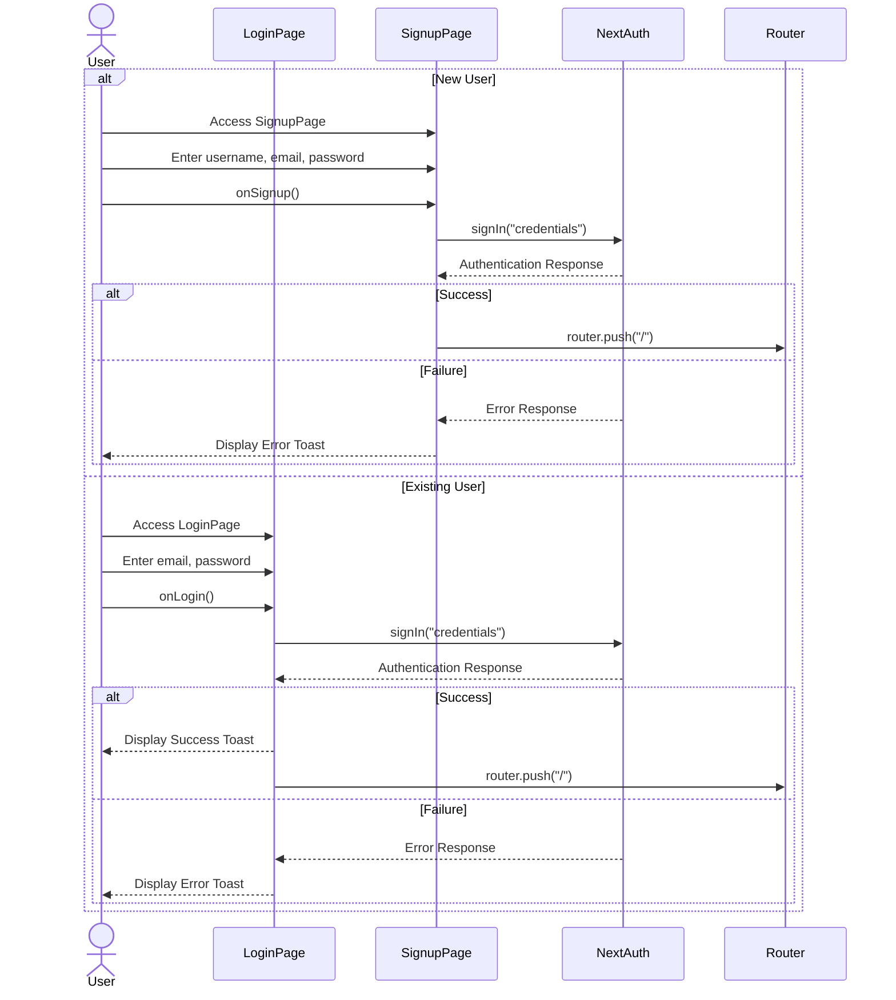
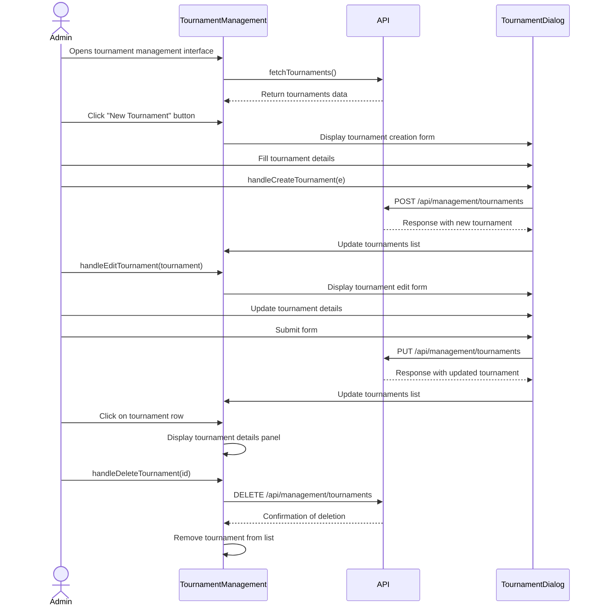
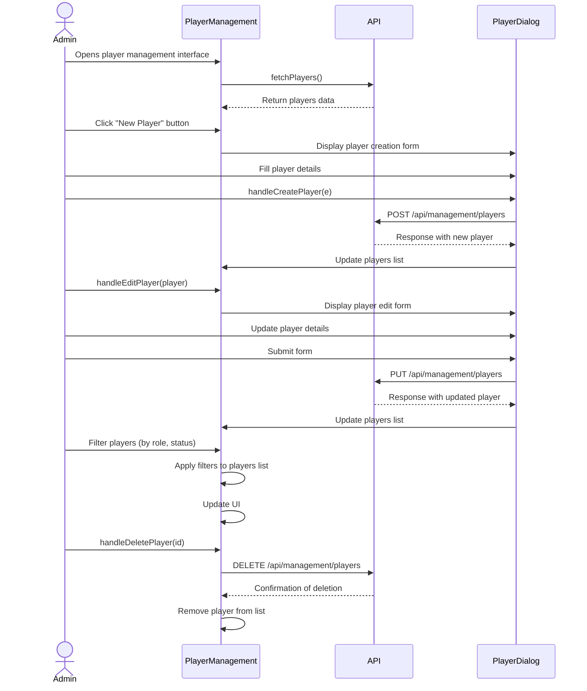
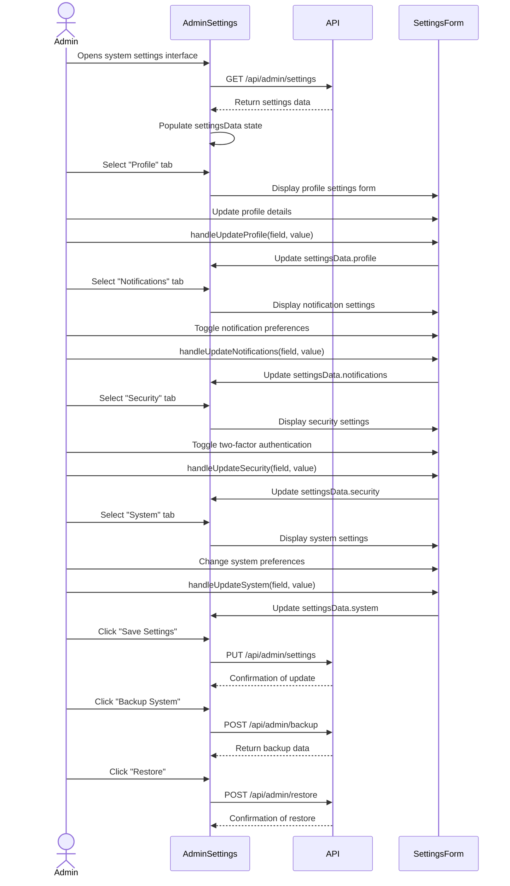
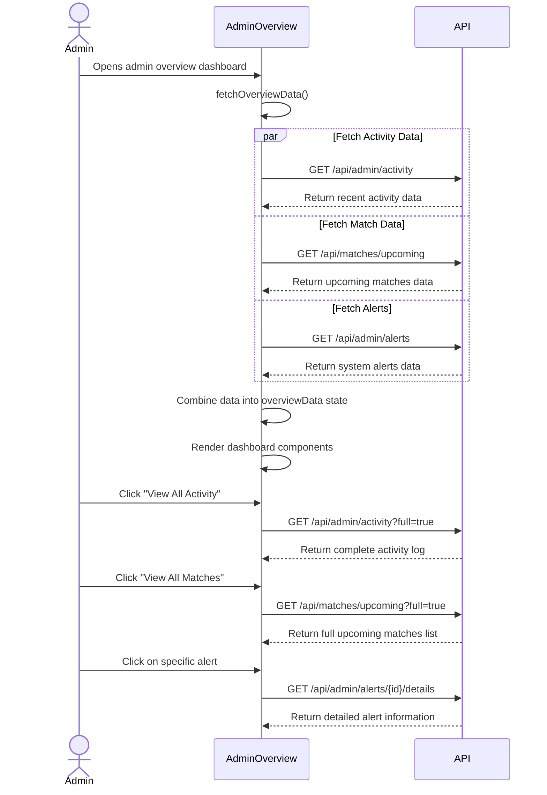

# Cricket Management System Admin Diagrams

## Class Diagram

```mermaid
classDiagram
    class Management {
        +render()
    }

    class VenueManagement {
        -venues: Venue[]
        -loading: boolean
        -searchQuery: string
        -openDialog: boolean
        -selectedVenue: Venue | null
        -activeTab: string
        +fetchVenues()
        +handleCreateVenue(e)
        +handleEditVenue(venue)
        +handleDeleteVenue(id)
        +handleStatusChange(id, newStatus)
        +filterVenues()
        +getStatusBadge(status)
        +render()
    }

    class MatchScheduling {
        -matches: Match[]
        -tournaments: Tournament[]
        -teams: Team[]
        -filteredTeams: Team[]
        -tournamentManagers: User[]
        -users: User[]
        -loading: boolean
        -actionLoading: boolean
        -searchQuery: string
        -openDialog: boolean
        -openDeleteDialog: boolean
        -selectedMatch: Match | null
        -matchToDelete: Match | null
        -activeTab: string
        -currentPage: number
        -formData: object
        +fetchMatches()
        +fetchTournaments()
        +fetchTeams()
        +fetchTeamsForTournament(tournamentId)
        +fetchManagersForTournament(tournamentId)
        +handleTournamentChange(tournamentId)
        +handleInputChange(e)
        +handleSelectChange(name, value)
        +resetForm()
        +handleOpenNewMatchDialog()
        +handleCreateMatch(e)
        +handleEditMatch(match)
        +handleUpdateMatch(e)
        +handleOpenDeleteDialog(match)
        +handleDeleteMatch()
        +handleCancelMatch(match)
        +handleStartMatch(match)
        +filterMatches()
        +getCurrentPageItems()
        +getStatusBadge(status, date)
        +getMatchScore(match)
        +render()
    }

    class TeamManagement {
        -teams: Team[]
        -loading: boolean
        -searchQuery: string
        -debouncedSearchQuery: string
        -openDialog: boolean
        -selectedTeam: Team | null
        -activeTab: string
        -currentPage: number
        -openDeleteDialog: boolean
        -teamToDelete: Team | null
        -tournaments: Tournament[]
        -selectedTournament: string
        -openPlayersDialog: boolean
        -selectedTeamDetails: TeamWithPlayers | null
        -loadingPlayers: boolean
        -globalMode: boolean
        -isFormSubmitting: boolean
        -tournamentFilter: string
        -availablePlayers: AvailablePlayer[]
        -selectedPlayersToAdd: string[]
        -loadingAvailablePlayers: boolean
        -openManagePlayersDialog: boolean
        -selectedPlayerTeamId: string | null
        -searchPlayerQuery: string
        -isSavingPlayers: boolean
        +fetchTeams()
        +fetchTournaments()
        +handleCreateTeam(e)
        +handleEditTeam(team)
        +handleUpdateTeam(e)
        +handleOpenDeleteDialog(team)
        +handleDeleteTeam()
        +handleViewTeamPlayers(teamId, openDialog)
        +filterTeams()
        +getCurrentPageItems()
        +getStatusBadge(status)
        +handleDialogClose()
        +getRoleBadge(role)
        +getPlayerStatusBadge(status)
        +getInitials(name)
        +fetchAvailablePlayers(teamId)
        +handleOpenManagePlayers(teamId)
        +handleAddPlayersToTeam()
        +handleRemovePlayerFromTeam(teamId, playerId, playerName)
        +handleDesignateRole(teamId, playerId, role, playerName)
        +render()
    }

    class LiveScoring {
        -matches: Match[]
        -loading: boolean
        -refreshing: boolean
        -isProcessing: Record<string, boolean>
        -activeMatch: Match | null
        -activeInnings: Innings | null
        -scoringDialogOpen: boolean
        -startMatchDialogOpen: boolean
        -wicketDialogOpen: boolean
        -selectedBattingTeam: string
        -selectedTossWinner: string
        -tossDecision: string
        -selectedBatsman: string
        -selectedBowler: string
        -selectedFielder: string
        -wicketType: string
        -mockBatsmen: Player[]
        -mockBowlers: Player[]
        -realBatsmen: Player[]
        -realBowlers: Player[]
        -isLoadingPlayers: boolean
        -apiError: string | null
        -inningsDialogOpen: boolean
        -inningsBattingTeam: string
        -inningsBowlingTeam: string
        -inningsNumber: number
        -isCreatingInnings: boolean
        -activeBatsmen: string[]
        -strikeBatsman: string
        -nonStrikeBatsman: string
        -dismissedBatsmen: Set<string>
        -batsmenDialogOpen: boolean
        -newBatsmanMode: boolean
        +fetchMatches()
        +createMockPlayers(teamId, prefix)
        +handleStartMatch(matchId)
        +confirmStartMatch()
        +fetchTeamPlayers(teamId)
        +handleOpenScoring(match)
        +loadPlayers(currentInnings)
        +createNewInnings()
        +selectBatsmen(striker, nonStriker)
        +selectNewBatsman(newBatsman)
        +swapBatsmen()
        +createNewOver()
        +handleAddRuns(runs)
        +handleAddExtras(extraType, runs)
        +openWicketDialog()
        +handleWicket()
        +getStatusBadge(status)
        +formatMatchDate(dateString)
        +render()
    }

    class BallDisplay {
        +getBallText(ball)
        +getBallColor(ball)
        +render()
    }

    class AdminSettings {
        -loading: boolean
        -settingsData: object
        -teamMembers: TeamMember[]
        +handleSaveSettings()
        +handleBackupData()
        +handleRestoreData()
        +handleUpdateProfile(field, value)
        +handleUpdateNotifications(field, value)
        +handleUpdateSecurity(field, value)
        +handleUpdateSystem(field, value)
        +render()
    }

    class AdminOverview {
        -loading: boolean
        -overviewData: object
        +fetchOverviewData()
        +render()
    }

    class SignupPage {
        -user: {username: string, email: string, password: string, confirmPassword: string}
        -buttonDisabled: boolean
        -loading: boolean
        +onSignup()
        +render()
    }

    class LoginPage {
        -user: {email: string, password: string}
        +onLogin()
        +render()
    }
    
    class TournamentManagement {
        -tournaments: Tournament[]
        -loading: boolean
        -searchQuery: string
        -openDialog: boolean
        -selectedTournament: Tournament | null
        -activeTab: string
        -currentPage: number
        +fetchTournaments()
        +handleCreateTournament(e)
        +handleEditTournament(tournament)
        +handleDeleteTournament(id)
        +filterTournaments()
        +render()
    }
    
    class PlayerManagement {
        -players: Player[]
        -loading: boolean
        -searchQuery: string
        -openDialog: boolean
        -selectedPlayer: Player | null
        -activeTab: string
        -currentPage: number
        +fetchPlayers()
        +handleCreatePlayer(e)
        +handleEditPlayer(player)
        +handleDeletePlayer(id)
        +filterPlayers()
        +render()
    }

    Management --> VenueManagement
    Management --> MatchScheduling
    Management --> TeamManagement
    Management --> LiveScoring
    Management --> AdminSettings
    Management --> AdminOverview
    Management --> TournamentManagement
    Management --> PlayerManagement
    LiveScoring --> BallDisplay

    class Venue {
        +id: string
        +name: string
        +city: string
        +address: string
        +capacity: number
        +facilities: string[]
        +status: 'available' | 'maintenance' | 'booked'
        +pitchType: string
        +matchesHosted: number
        +image?: string
    }

    class Match {
        +_id: string
        +tournament_id: object
        +team1: Team
        +team2: Team
        +venue: string
        +date: string
        +time: string
        +status: string
        +innings?: Innings[]
        +match_format: string
        +handler: object
        +winningTeam?: string
        +cancellationReason?: string
        +match_type: string
        +overs?: number
        +id?: string
    }

    class Tournament {
        +_id: string
        +id?: string
        +tournamentName: string
        +status: string
        +userManagers?: object[]
        +teams?: number
    }

    class Team {
        +id: string
        +teamName: string
        +shortCode?: string
        +logo?: string
        +captain?: string
        +coach: string
        +players: number
        +playerCount?: number
        +status: 'active' | 'inactive'
        +tournament?: object
        +tournament_id?: string
        +wins?: number
        +losses?: number
    }

    class Player {
        +_id: string
        +playerName: string
        +role: string
        +battingStyle: string
        +bowlingStyle: string
        +status: string
        +isCaptain: boolean
        +isViceCaptain: boolean
        +isWicketKeeper: boolean
    }

    class Innings {
        +_id: string
        +team: {batting_team: Team, bowling_team: Team}
        +runs: number
        +wickets: number
        +overs: Over[]
        +extras: object
    }

    class Over {
        +_id: string
        +over_number: number
        +bowler: Player | string
        +balls: Ball[]
    }

    class Ball {
        +ball_number: number
        +batsman: Player | string
        +bowler: Player | string
        +runs: number
        +wicket: object
        +extras: object
    }
```

## Sequence Diagrams

### 1. Team Management Workflow



### 2. Match Scheduling Workflow



### 3. Live Scoring Workflow



### 4. Authentication Workflow




### 6. Tournament Management Workflow



### 7. Player Management Workflow



### 8. Admin Settings Workflow



### 9. Admin Overview Dashboard Workflow


