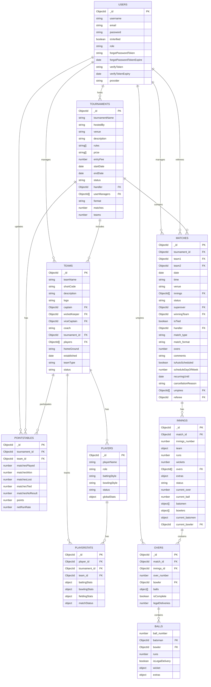
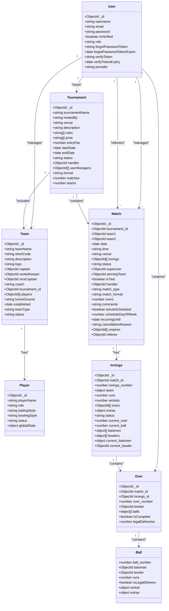

```mermaid
erDiagram
    USERS {
        ObjectId _id PK
        string username
        string email
        string password
        boolean isVerified
        string role
        string forgotPasswordToken
        date forgotPasswordTokenExpire
        string verifyToken
        date verifyTokenExpiry
        string provider
    }

    TOURNAMENTS {
        ObjectId _id PK
        string tournamentName
        string hostedBy
        string venue
        string description
        string[] rules
        string[] prize
        number entryFee
        date startDate
        date endDate
        string status
        ObjectId handler FK
        ObjectId[] userManagers FK
        string format
        number matches
        number teams
    }

    TEAMS {
        ObjectId _id PK
        string teamName
        string shortCode
        string description
        string logo
        ObjectId captain FK
        ObjectId wicketKeeper FK
        ObjectId viceCaptain FK
        string coach
        ObjectId tournament_id FK
        ObjectId[] players FK
        string homeGround
        date established
        string teamType
        string status
    }

    POINTSTABLES {
        ObjectId _id PK
        ObjectId tournament_id FK
        ObjectId team_id FK
        number matchesPlayed
        number matchesWon
        number matchesLost
        number matchesTied
        number matchesNoResult
        number points
        number netRunRate
    }

    PLAYERS {
        ObjectId _id PK
        string playerName
        string role
        string battingStyle
        string bowlingStyle
        string status
        object globalStats
    }

    PLAYERSTATS {
        ObjectId _id PK
        ObjectId player_id FK
        ObjectId tournament_id FK
        ObjectId team_id FK
        object battingStats
        object bowlingStats
        object fieldingStats
        object matchStatus
    }

    MATCHES {
        ObjectId _id PK
        ObjectId tournament_id FK
        ObjectId team1 FK
        ObjectId team2 FK
        date date
        string time
        string venue
        ObjectId[] innings FK
        string status
        ObjectId superover FK
        ObjectId winningTeam FK
        boolean isTied
        ObjectId handler FK
        string match_type
        string match_format
        number overs
        string comments
        boolean isAutoScheduled
        number scheduleDayOfWeek
        date recurringUntil
        string cancellationReason
        ObjectId[] umpires FK
        ObjectId referee FK
    }

    INNINGS {
        ObjectId _id PK
        ObjectId match_id FK
        number innings_number
        object team
        number runs
        number wickets
        ObjectId[] overs FK
        object extras
        string status
        number current_over
        number current_ball
        object[] batsmen
        object[] bowlers
        object current_batsmen
        ObjectId current_bowler FK
    }

    OVERS {
        ObjectId _id PK
        ObjectId match_id FK
        ObjectId innings_id FK
        number over_number
        ObjectId bowler FK
        object[] balls
        boolean isComplete
        number legalDeliveries
    }

    BALLS {
        number ball_number
        ObjectId batsman FK
        ObjectId bowler FK
        number runs
        boolean isLegalDelivery
        object wicket
        object extras
    }

    USERS ||--o{ TOURNAMENTS : "hosts"
    USERS ||--o{ MATCHES : "manages"
    USERS ||--o{ TEAMS : "manages"
    USERS ||--o{ POINTSTABLES : "updates"
    USERS ||--o{ OVERS : "umpires"
    USERS ||--o{ MATCHES : "referees"
    TOURNAMENTS ||--o{ TEAMS : "includes"
    TOURNAMENTS ||--o{ MATCHES : "contains"
    TOURNAMENTS ||--o{ POINTSTABLES : "has"
    TEAMS ||--o{ PLAYERS : "has"
    TEAMS ||--o{ PLAYERSTATS : "tracks"
    MATCHES ||--o{ INNINGS : "has"
    INNINGS ||--o{ OVERS : "contains"
    OVERS ||--o{ BALLS : "contains"
    PLAYERS ||--o{ PLAYERSTATS : "has"
    TEAMS ||--o{ POINTSTABLES : "participates"
```

```mermaid
classDiagram
    class User {
        +ObjectId _id
        +string username
        +string email
        +string password
        +boolean isVerified
        +string role
        +string forgotPasswordToken
        +date forgotPasswordTokenExpire
        +string verifyToken
        +date verifyTokenExpiry
        +string provider
    }

    class Tournament {
        +ObjectId _id
        +string tournamentName
        +string hostedBy
        +string venue
        +string description
        +string[] rules
        +string[] prize
        +number entryFee
        +date startDate
        +date endDate
        +string status
        +ObjectId handler
        +ObjectId[] userManagers
        +string format
        +number matches
        +number teams
    }

    class Team {
        +ObjectId _id
        +string teamName
        +string shortCode
        +string description
        +string logo
        +ObjectId captain
        +ObjectId wicketKeeper
        +ObjectId viceCaptain
        +string coach
        +ObjectId tournament_id
        +ObjectId[] players
        +string homeGround
        +date established
        +string teamType
        +string status
    }

    class Player {
        +ObjectId _id
        +string playerName
        +string role
        +string battingStyle
        +string bowlingStyle
        +string status
        +object globalStats
    }

    class Match {
        +ObjectId _id
        +ObjectId tournament_id
        +ObjectId team1
        +ObjectId team2
        +date date
        +string time
        +string venue
        +ObjectId[] innings
        +string status
        +ObjectId superover
        +ObjectId winningTeam
        +boolean isTied
        +ObjectId handler
        +string match_type
        +string match_format
        +number overs
        +string comments
        +boolean isAutoScheduled
        +number scheduleDayOfWeek
        +date recurringUntil
        +string cancellationReason
        +ObjectId[] umpires
        +ObjectId referee
    }

    class Innings {
        +ObjectId _id
        +ObjectId match_id
        +number innings_number
        +object team
        +number runs
        +number wickets
        +ObjectId[] overs
        +object extras
        +string status
        +number current_over
        +number current_ball
        +object[] batsmen
        +object[] bowlers
        +object current_batsmen
        +ObjectId current_bowler
    }

    class Over {
        +ObjectId _id
        +ObjectId match_id
        +ObjectId innings_id
        +number over_number
        +ObjectId bowler
        +object[] balls
        +boolean isComplete
        +number legalDeliveries
    }

    class Ball {
        +number ball_number
        +ObjectId batsman
        +ObjectId bowler
        +number runs
        +boolean isLegalDelivery
        +object wicket
        +object extras
    }

    User "1" --> "*" Tournament : "hosts"
    User "1" --> "*" Match : "manages"
    User "1" --> "*" Team : "manages"
    User "1" --> "*" Over : "umpires"
    User "1" --> "*" Match : "referees"
    Tournament "1" --> "*" Team : "includes"
    Tournament "1" --> "*" Match : "contains"
    Team "1" --> "*" Player : "has"
    Match "1" --> "*" Innings : "has"
    Innings "1" --> "*" Over : "contains"
    Over "1" --> "*" Ball : "contains"
```
