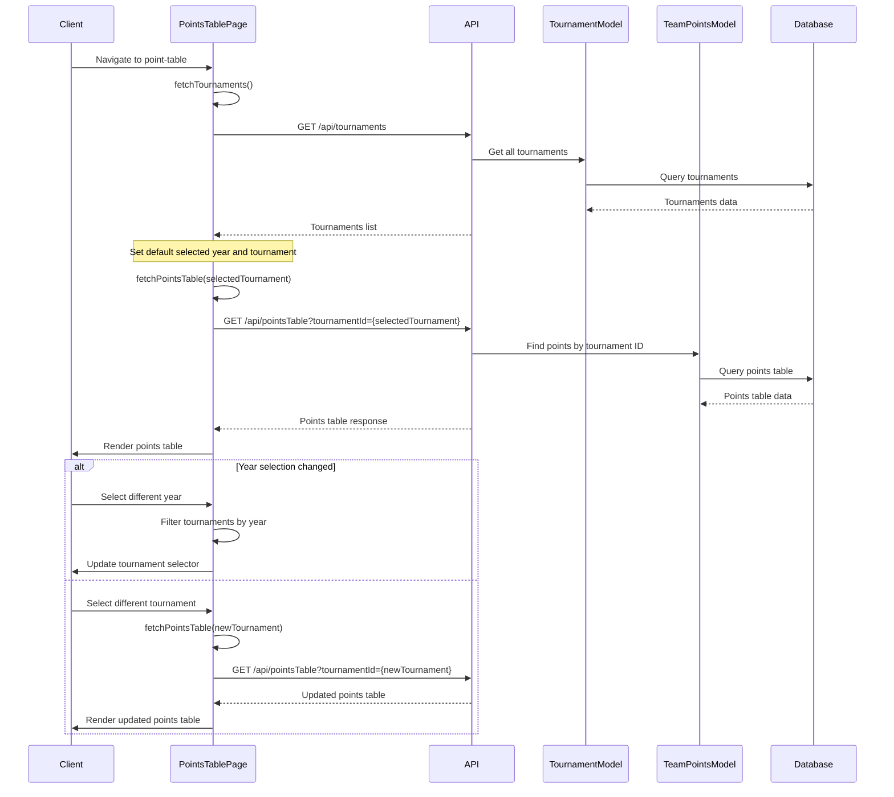
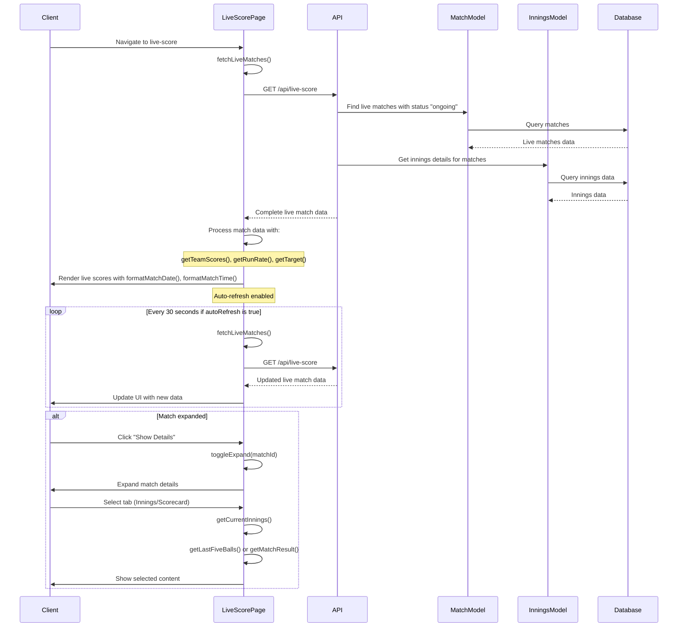
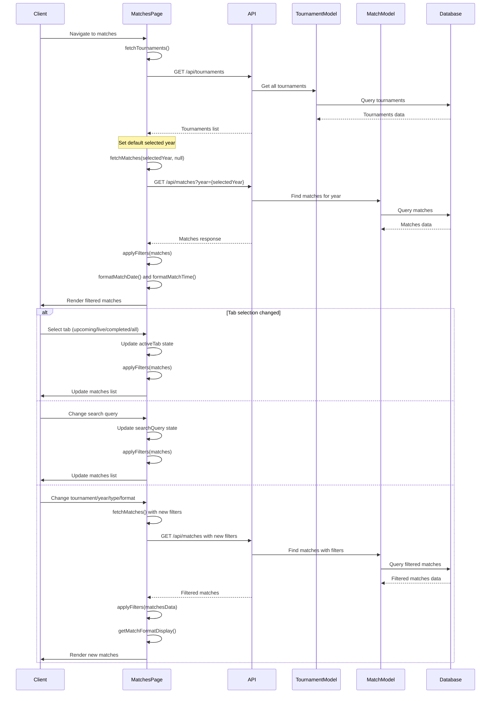
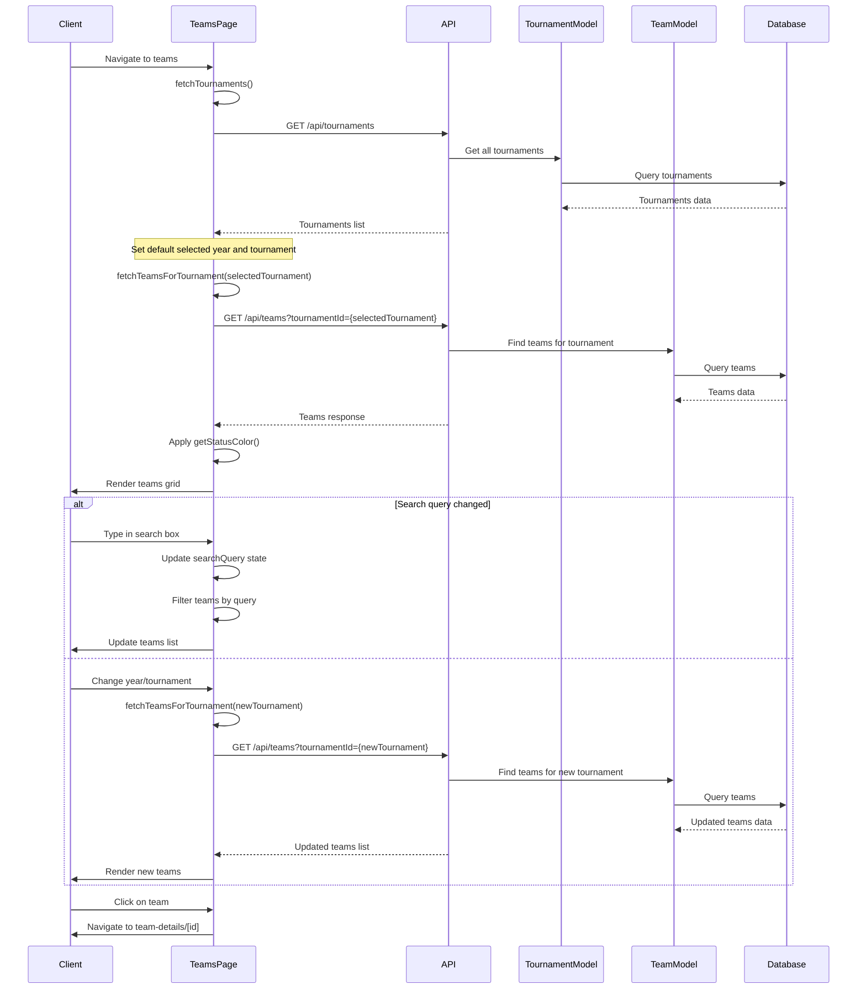

# Cricket Tournament Management System Diagrams

## Class Diagram

```mermaid
classDiagram
    class Tournament {
        +String _id
        +String tournamentName
        +Date startDate
        +Date endDate
        +String venue
        +getAll()
        +getById(id)
        +getByYear(year)
    }
    
    class Team {
        +String _id
        +String teamName
        +String shortCode
        +Tournament tournament_id
        +Array~String~ players
        +Array~Player~ playersInfo
        +String status
        +String coach
        +String captain
        +Number playerCount
        +getByTournament(tournamentId)
        +getTeamDetails(id, tournamentId)
    }
    
    class Player {
        +String _id
        +String player_id
        +String name
        +String role
        +String originalRole
        +String battingStyle
        +String bowlingStyle
        +String status
        +Boolean isCapt
        +Boolean isViceCapt
        +Boolean isWicketKeeper
        +PlayerStats globalStats
        +PlayerStats tournamentStats
        +getById(id)
        +getByTeam(teamId)
    }
    
    class PlayerStats {
        +BattingStats batting
        +BowlingStats bowling
        +FieldingStats fielding
    }
    
    class BattingStats {
        +Number matches
        +Number runs
        +Number strikeRate
        +Number average
        +Number fifties
        +Number centuries
        +Number ballsFaced
    }
    
    class BowlingStats {
        +Number matches
        +Number oversBowled
        +Number wickets
        +Number economyRate
        +Number bowlingAverage
        +String bestFigures
    }
    
    class FieldingStats {
        +Number catches
        +Number stumpings
    }
    
    class Match {
        +String _id
        +Tournament tournament_id
        +Team team1
        +Team team2
        +Date date
        +String time
        +String venue
        +Array~Innings~ innings
        +String status
        +Team winningTeam
        +String match_type
        +String match_format
        +Number overs
        +String comments
        +getByYear(year)
        +getByTournament(tournamentId)
        +getLiveMatches()
        +getById(id)
        +getFilteredMatches(filters)
    }
    
    class Innings {
        +String _id
        +Object teamData
        +Number runs
        +Number wickets
        +Array~Over~ overs
        +Object extrasData
        +getByMatchId(matchId)
    }
    
    class Over {
        +String _id
        +Number over_number
        +String bowler
        +Array~Ball~ balls
    }
    
    class Ball {
        +Number ball_number
        +Object batsmanData
        +Object bowlerData
        +Number runs
        +Object wicketData
        +Object extrasData
    }
    
    class TeamPoints {
        +String team_id
        +String teamName
        +Number matchesPlayed
        +Number matchesWon
        +Number matchesLost
        +Number points
        +Number netRunRate
        +getByTournament(tournamentId)
    }
    
    class TeamDetailsPage {
        -useState(loading, teamDetails, activeTab, statView)
        -useEffect(fetchTeamDetails)
        -useParams(id)
        -useRouter()
        +fetchTeamDetails()
        +formatDate(dateString)
        +getStatusColor(status)
        +getInitials(name)
        +getRoleBadgeColor(role)
        +getBattingPlayers()
        +getBowlingPlayers()
        +getFieldingPlayers()
    }
    
    class PointsTablePage {
        -useState(tournaments, selectedYear, selectedTournament, pointsTable, filteredTournaments, loading)
        -useEffect(fetchTournaments, filterTournaments, fetchPointsTable)
        +fetchTournaments()
        +fetchPointsTable(tournamentId)
    }
    
    class LiveScorePage {
        -useState(matches, loading, refreshing, selectedMatch, expandedMatches, autoRefresh)
        -useEffect(fetchLiveMatches, autoRefreshInterval)
        +fetchLiveMatches()
        +toggleExpand(matchId)
        +formatMatchDate(dateString)
        +formatMatchTime(timeString)
        +getMatchStatus(match)
        +getCurrentInnings(match)
        +getTeamScores(match)
        +getRunRate(runs, overs)
        +getRequiredRunRate(match)
        +getTarget(match)
        +getLastFiveBalls(match)
        +getMatchResult(match)
    }
    
    class MatchesPage {
        -useState(matches, filteredMatches, tournaments, selectedYear, selectedTournament, selectedType, selectedFormat, searchQuery, loading, activeTab)
        -useEffect(fetchTournaments, fetchMatches, applyFilters)
        +fetchTournaments()
        +fetchMatches(year, tournamentId)
        +applyFilters(matchesData)
        +formatMatchDate(dateString)
        +formatMatchTime(timeString)
        +getMatchFormatDisplay(format, overs)
    }
    
    class TeamsPage {
        -useState(teams, filteredTeams, tournaments, selectedYear, selectedTournament, filteredTournaments, searchQuery, loading)
        -useEffect(fetchTournaments, filterTournamentsByYear, fetchTeamsForTournament, filterTeamsBySearch)
        +fetchTournaments()
        +fetchTeamsForTournament(tournamentId)
        +getStatusColor(status)
    }
    
    Tournament "1" -- "*" Team: has
    Tournament "1" -- "*" Match: hosts
    Team "1" -- "*" Player: contains
    Team "1" -- "*" TeamPoints: earns
    Match "1" -- "2" Team: played between
    Match "1" -- "*" Innings: has
    Innings "1" -- "*" Over: contains
    Over "1" -- "*" Ball: includes
    Player "1" -- "1" PlayerStats: has
    PlayerStats "1" -- "1" BattingStats: includes
    PlayerStats "1" -- "1" BowlingStats: includes
    PlayerStats "1" -- "1" FieldingStats: includes
    
    TeamDetailsPage --> Team: uses
    TeamDetailsPage --> Player: uses
    PointsTablePage --> Tournament: uses
    PointsTablePage --> TeamPoints: uses
    LiveScorePage --> Match: uses
    LiveScorePage --> Innings: uses
    MatchesPage --> Tournament: uses
    MatchesPage --> Match: uses
    TeamsPage --> Tournament: uses
    TeamsPage --> Team: uses
## Sequence Diagram - Team Details Page

```mermaid
sequenceDiagram
    participant Client
    participant TeamDetailsPage
    participant API
    participant TeamModel
    participant PlayerModel
    participant Database
    
    Client->>TeamDetailsPage: Navigate to team-details/[id]
    Note over TeamDetailsPage: useParams to get id and tournament_id
    
    TeamDetailsPage->>TeamDetailsPage: fetchTeamDetails()
    TeamDetailsPage->>API: GET /api/teams/team-details/{id}?tournament_id={tournament_id}
    API->>TeamModel: Find team by ID
    TeamModel->>Database: Query team
    Database-->>TeamModel: Team data
    
    API->>PlayerModel: Find players info
    PlayerModel->>Database: Query players
    Database-->>PlayerModel: Players data
    
    API->>TeamModel: Populate players info
    TeamModel-->>API: Complete team data with players
    
    API-->>TeamDetailsPage: Team details response
    
    TeamDetailsPage->>TeamDetailsPage: formatDate()
    TeamDetailsPage->>TeamDetailsPage: getStatusColor()
    TeamDetailsPage->>TeamDetailsPage: getInitials()
    
    TeamDetailsPage->>Client: Render team details UI
    
    alt Tab selection = "overview"
        Client->>TeamDetailsPage: Click on "Overview" tab
        TeamDetailsPage->>Client: Display player grid with getInitials()
    else Tab selection = "players"
        Client->>TeamDetailsPage: Click on "Players" tab  
        TeamDetailsPage->>TeamDetailsPage: getRoleBadgeColor()
        TeamDetailsPage->>Client: Display detailed player info
    else Tab selection = "stats"
        Client->>TeamDetailsPage: Click on "Stats" tab
        TeamDetailsPage->>TeamDetailsPage: getBattingPlayers()
        TeamDetailsPage->>TeamDetailsPage: getBowlingPlayers()
        TeamDetailsPage->>TeamDetailsPage: getFieldingPlayers()
        TeamDetailsPage->>Client: Display batting/bowling/fielding stats
    end
```

## Sequence Diagram - Points Table Page



## Sequence Diagram - Live Score Page



## Sequence Diagram - Matches Page



## Sequence Diagram - Teams Page


